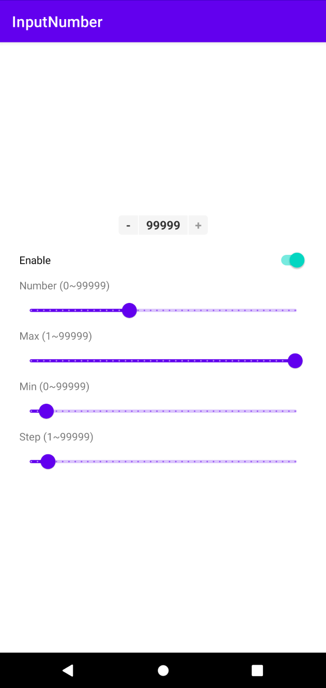

# InputNumber

> Input numerical values with a customizable range.

|||
|:---:|:---:|
|***Home***|***Input dialog***|

## Introduction

- Limit input `maximum` and `minimum`
- Predict in advance whether the ***next operation*** meets the conditions, and change the button
  state
- Support to update the quantity ***after confirmation***, such as network request

## TODO

- [x] Custom input
- [ ] The internal does not handle the situation that the minimum and maximum values are reached,
  and the ***callback*** is sent to the external processing
- [ ] Provide an intuitive way for users to set control styles